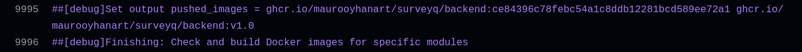

# SurveyQ

A modularized survey backend application (backend, session, logging and notifications modules) with some DevOps pipelines and concepts attached.

No UI present in this project.

Made with Java 17, Postgres 16, Traefik (2.11, 3.3.3) and Docker 27.5.1.

Hosted on https://surveyq.mauro-oyhanart.com (turn-on on request)
- access https://surveyq.mauro-oyhanart.com/public/surveys to see all surveys
- access https://surveyq.mauro-oyhanart.com/public/questions to see all questions
- pretty much all other access has to be done via tools like curl, wget or Postman. See the API documentation.


Documentation in progress: [API Docs](/api-docs)

# Modules

## Backend

Features:
- create a survey, empty or with questions
- add questions to a survey
- see surveys
- public or private surveys
- share a survey (not yet)
- published or unpublished survey (not yet)
- take a survey
- see responses of your surveys
- log in as USER or ADMIN
- authentication and authorization for all types of object access (read, write, etc)

A more in depth documentation of this module and the use of JPA, Tests and Patters in Spring, exists in [backend README file](backend/README.md).

## Session

Features:
- sign up
- log in (obtain a jwt) as USER or ADMIN
- see users (for admins only)

## Logging

Features:
- http server for logging to a file and to a database (postgres for now, should be cassandra). For accountability and auditing purposes.

## Messaging

Features:
- http server to handle notifications such as email or 3rd party integrations. Not yet implemented.

## shared

Code made available for use in other modules:
- HttpClient
- HttpLogger, which uses the HttpClient
- Log, LogRequest, for use with the HttpLogger.

See more in the [shared README file](shared/README.md).

## Storage

One PostgreSQL database per service. All with their Dockerfile and their init-db.sh for pre-loading information into a custom Docker image.

### backend postgres

Contains the `survey` database with the following tables:
- app_user
- checked_items
- question
- question_item
- question_response
- rated_item_response
- survey
- survey_response

##### -> PostgreSQL Logical Replication

We only need id and email in the `app_user` table. Hence, this database contains a subscription to a publication that the session postgres publishes, via logical replication, to have a constantly updated subset of the `app_user` table of the session database, which is more complete.

### session postgres

Contains the `survey_session` database with the following tables:
- app_user
- role
- user_roles

##### -> PostgreSQL Logical Replication

Has a publication for the `app_user` table.

### logging postgres

Contains the `survey_logging` database with logs for all other applications.

### messaging postgres

Contains the `survey_messaging` database with information about notifications and 3rd party integrations. Not yet implemented.

## shared module

Shared code for all surveys: a [HttpClient](shared/src/main/java/com/maurooyhanart/surveyq/HttpClient.java), a [HttpLogger](shared/src/main/java/com/maurooyhanart/surveyq/log/HttpLogger.java) and some helper classes.

# Docker

Docker is used in this repository to construct images for each service, as well as for each postgres server.

We wrap the backend, session, logging and messaging services under docker images (one each), and we do the same with each postgresql database.

There is one Dockerfile for all java service images, and one Dockerfile per database image.

#### We build a Docker image for a service like this:

```sh
cd backend/
bash build.sh 1.1
```

where the build.sh script looks like this:

```sh
docker build --build-arg MODULE_NAME=backend --build-arg VERSION=$1 -t survey-backend:v$1 -f ../Dockerfile .. # builds the java backend module image
```

#### Same for the postgres images:

```sh
cd storage/session/
bash build.sh # builds the survey-session-postgres image
```

## A closer look at the Dockerfile for java services

We have two stages in the [Dockerfile](Dockerfile):
- a build stage, that generates a jar as an artifact
- a runtime stage, that configures the jar to run with the JRE.

Looking at the build stage:

```Dockerfile
FROM maven:3.9-eclipse-temurin-17 AS builder

ENV SPRING_PROFILES_ACTIVE=docker

WORKDIR /app

COPY . .

ARG MODULE_NAME=backend
ARG VERSION=v1
ENV MODULE_NAME=$MODULE_NAME
ENV VERSION=$VERSION
```

We always try to put, in the top, the sentences that will change the least; so that docker layers are not discarded upon cache hits when a modification occurs.

There is a trade-off to be made here: this Dockerfile will have its cache permanently discarded upon any code change in any module.

What do we gain? We gain, by sacrificing speed, the ability to use this Dockerfile for all modules; we aim for simplicity.

That being said, if the code hasn't changed and we want to compile another module, the `COPY . .` layer will be reused, which is what we want.
# Deploy

There are several ways to deploy this application, which can be tested at surveyq.mauro-oyhanart.com on turn-on request (AWS is expensive).

## Docker Compose with Traefik

Using Traefik as a proxy router, we can do this:


We define the traefik service:


And then we can route requests to specific services:

```yml
  backend:
    image: survey-backend:v1
    container_name: survey-backend
    restart: unless-stopped
    labels:
      - "traefik.enable=true"
      - "traefik.http.routers.survey-backend.rule=Host(`surveyq.mauro-oyhanart.com`) && (PathPrefix(`/api`) || PathPrefix(`/internal`) || PathPrefix(`/public`))"
      # HTTPS
      - "traefik.http.routers.survey-backend.entrypoints=websecure"
      - "traefik.http.routers.survey-backend.tls.certresolver=myresolver"
      # Service
      - "traefik.http.services.survey-backend.loadbalancer.server.port=8080"
      # Catch-all router
      - "traefik.http.routers.catch-all.rule=Host(`surveyq.mauro-oyhanart.com`)"
      - "traefik.http.routers.catch-all.priority=1"
      - "traefik.http.routers.catch-all.entrypoints=websecure"
      - "traefik.http.routers.catch-all.tls.certresolver=myresolver"
      - "traefik.http.services.catch-all.loadbalancer.server.port=8080"
    networks:
      - survey_network
```

An equivalent definition exists for the session service. The logging and messaging services are not enabled for traefik, since no outside communication agent will ever need to reach them.

## Docker Compose locally

Omitted. Same thing than with traefik, but without traefik.

## Docker Swarm

Docker container orchestration today (2025) has K8s as mainstream. For small projects it can be a burden. I choose docker swarm first for simplicity. Less features, less elasticity, more simplicity.

We start by defining a [service.yml](/deploy/docker-swarm/service.yml).

Traefik will [route to services](https://doc.traefik.io/traefik/providers/swarm/#routing-configuration-with-labels) for us.

We define labels on the service level, and traefik takes care of routing:

```yml
  backend:
    image: ghcr.io/maurooyhanart/surveyq/backend:v1.0
    deploy:
      mode: replicated
      replicas: 1
      restart_policy:
        condition: on-failure
      labels:
        - "traefik.enable=true"
        - "traefik.http.routers.survey-backend.rule=Host(`surveyq.mauro-oyhanart.com`) && (PathPrefix(`/api`) || PathPrefix(`/internal`) || PathPrefix(`/public`))"
        - "traefik.http.routers.survey-backend.entrypoints=websecure"
        - "traefik.http.routers.survey-backend.tls.certresolver=myresolver"
        - "traefik.http.services.survey-backend.loadbalancer.server.port=8080"
    networks:
      - survey_network
```

The backend module listens in /api, /internal, and /public.

An equivalent definition exists for the session module.

The logging module has no traefik labels defined, since we want to route internally for logging and not depend on traefik (we're not really exposing logging to the outside world).

Deploying with [deploy.sh](/deploy/docker-swarm/deploy.sh) when swarm mode is enabled:

```shell
docker stack deploy -c service.yml survey-app
```

Will create all services:


## The docker registry

We use [ghcr](https://docs.github.com/en/packages/working-with-a-github-packages-registry/working-with-the-container-registry), the GitHub alternative to Docker Hub.

We can build and push images to this registry (from wherever) and log in to the registry in the server. When the stack is deployed in docker swarm, it will pull every image it needs to run the services. If the images don't exist (assume a worker node has not pulled them) then Swarm takes care of that with the option (on stack creation time) `--with-registry-auth`.

## Assembling Java, Postgres, Docker, Testing, Building, Docker Swarm and Github Actions in a CI/CD pipeline

The main goal of this project is to showcase what can be achieved with a bit of all of these tools.

### What we need

As in every CI/CD pipeline, we need to:
- test
- detect what's changed
- build the differential
- push images
- deploy
- check that what's been deployed doesn't fall apart
- monitor (this part is missing for now)

We take all of that and we build this:


We have a [workflow file powered by GitHub Actions](.github/workflows/test-build-push-to-registry-deploy.yml), in where we do the above defined steps.

For versioning, we double tag each image: 
- the git sha is a unique identifier, and I use it to automatically know which commit generated the build.
- the version, taken from each `pom.xml` (or in the case of the storage modules, a regular `version` file)

And so on every push, we have the code built and sent to ghrc:


The last thing the workflow does after pulling the image in the server is updating the service:

```shell
for image in "${images[@]}"; do
    docker pull $image
    echo "pulled $image" >> pull_history.txt
    service_name="$(find_service_name "$image")"
    echo "::debug:: service_name to update: $service_name"
    docker service update --image "$image" --force "$service_name"
done
```

### An example

An example where the handling of the `AuthorizationDeniedException` was improved (it was being caught as a general `RuntimeException`) in the backend module.

A commit was made and a push was issued. This event automatically triggers the workflow run.


- Code is tested
- Changes are detected:


- And the image is built & pushed:



